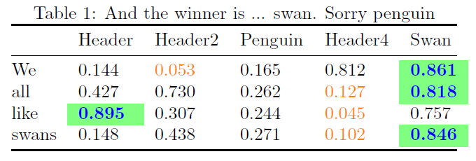
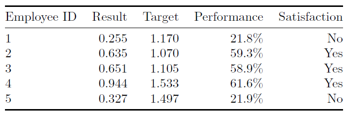

# LatexTables

A simple utility to convert `Julia` tables into `LaTex`. While it supports formatting, highlighting maximal or minimal values, adding captions, labels, header, cell alignment and other options, it is very simple to use.

## Installation
Execute the following command in Julia
```julia
Pkg.add("https://github.com/sadda/LatexTables.jl/")
```

## Simple example 1

```julia
body        = rand(4,5)
body[:,3]   = 0.3*rand(4)
body[:,end] = 0.7.+0.3*rand(4)

s1 = table_to_tex(body;
    highlight_max_row=true,
    highlight_min_row=true,
    caption="And the winner is ... swan. Sorry penguin",
    leading_col=["We", "all", "like", "swans"],
    header=["Header", "Header2", "Penguin", "Header4", "Swan"],
)
print(s1)
```

It creates a table in `body` and calls `table_to_tex` to create a string for the table. Optional arguments `highlight_max_row` and `highlight_max_row` use the default highlighting (can be changed) for the maximal and minimal value in each row. Moreover, `caption` specifies caption, `leading_col` the names of the leading column and `header` the name of the header. Table can be printed into the REPL by calling `print` on the output. To create the tex and pdf files, use
```
make_tex_file("test1.tex", s1; dir_name="output", compile=true)
```
The created example 



## Simple example 2


```julia
n    = 5
x1   = rand(n)
x2   = 1 .+ rand(n)
body = hcat(collect(1:n), x1, x2, x1./x2, [x./y >= 0.5 ? "Yes" : "No" for (x,y) in zip(x1,x2)])

s2 = table_to_tex(body;
    col_format=["d", "", "", "1p", ""],
    header=["Employee ID", "Result", "Target", "Performance", "Satisfaction"],
    alignment="lrrrr",
)
print(s2)
```

In this table, we specify the column formatting `col_format = ["d", "", "", "1p", ""]`. The first column is integer, the fourth one is in percents (it is multipled by 100 automatically) while the remaining ones are default (either float or string). The cell alignment `alignment` is specified and thus, the first column is left-aligned while the remaining ones are right-aligned.





# LaTex requirements

The tables are written in default for `booktabs` (use `table_type=:tabular` if not interested). Since highlighting uses colors, it is recommended to include to following packages in the LaTex preamble.
```latex
\usepackage{xcolor}
\usepackage{colortbl}
\usepackage{booktabs}
```

# Optional arguments

Function `table_to_tex` supports a large number of optional arguments.

| Argument | Comments |
| ----- | ----- |
| `col_format` | Column formatting. Accepts either `Array{String}` or `String`. The allowed values are </br> <ul><li>"s" for `string`</li><li>"d" for `integer`</li><li>"3f" for `float`</li><li>"1p" for percentage $24.1\%$</li><li>"2e" for exponential notation $1.31\cdot 10^{-3}$</li></ul> |
| `row_format` | Row formatting. The same rules as for `col_format` |
| `table_type` | Table type. Allowed values `:booktabs` and `:tabular`. The former requires `usepackage{booktabs}` in the LaTex preamble. |
| `leading_col` | Names of the leading column. Accepts `Array{String}` or empty. |
| `header` | Names of the header (possibly multiple lines). Accepts `Array{String}`, `Matrix{String}` or empty. |
| `position` | Position of the floating environment such as `begin{table}[!ht]`. |
| `caption` | Caption of the table. Accepts either `String` or empty. The latter will not print anything. |
| `label` | Label of the table. Accepts either `String` or empty. The latter will not print anything. |
| `centering` | `Bool` value whether `centering` will be added to the table |
| `alignment` | Alignment of the columns. Accepts either `String`, `Char` or empty. The second option will propagate it for all columns. |
| `floating_table` | `Bool` value whether `tabular` will be in the `table` floating environment. |
| `caption_position_top` | `Bool` value whether the caption and label will be above the table. |
| `highlight_max_row` | `Bool` value whether the maximum of each row will be highlighted. |
| `highlight_min_row` | `Bool` value whether the minimum of each row will be highlighted. |
| `highlight_max_col` | `Bool` value whether the maximum of each column will be highlighted. |
| `highlight_min_col` | `Bool` value whether the minimum of each column will be highlighted. |
| `highlight_max_style` | Highlighting style for the minimal value. It accepts `CellColor(:green!50)` for green cells with smaller opacity, `Color(:blue)` for blue text, `Style(:bold)` for bold or `Style(:italic)` or italic. These values (with possibly different color) can be combined in an array. |
| `highlight_max_style` | Highlighting style for the minimal value. The same rules as `highlight_min_style`. |
